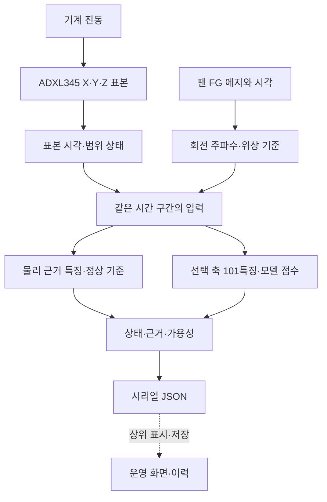

# 1. 전체 시스템: 진동에서 점검 정보까지

**보고서 위치:** Ⅰ 작품요약(3~4쪽), Ⅱ 개요(4~5쪽), Ⅲ-1 전체 구성(5~7쪽)

## 데이터 흐름

엣지알리미는 진동 표본과 표본 시각을 수집하고, FG 펄스로 회전 주파수와 위상 기준을 만든다. 입력 품질값을 계산한 뒤 물리 근거 경로와 학습 모델 경로에서 각각 특징을 만들고, 상태·점수·가용성 정보를 JSON으로 출력한다.

| 경로 | 입력 | 계산 | 출력 |
|---|---|---|---|
| 물리 근거 | X/Y/Z 가속도, FG 회전 기준, 설비 정보 | 정상 기준 대비 에너지·형상 변화, 회전 차수 후보 | normal, suspected, unavailable, 후보 근거와 가용성 사유 |
| 학습 모델 | 선택한 가속도 축, 회전 속도 | 101개 특징, 네 상태의 선형 결정 마진 | 후보 label과 네 점수 |

근거 강도(`strength`)는 물리 경로의 후보별 0~100 지표이고, `relative`는 가용 후보 사이에서 정규화한 비중이다. ML의 SVM 점수는 클래스별 선형 마진이다. 각 값은 계산 경로와 출력 단위에 따라 읽는다.

보고서와 현재 구현에는 센서 입력부터 JSON까지의 경로가 담겨 있다. 전류·온도는 보고서의 보조 운전 정보이며, 핵심 진동 판정 입력은 가속도와 FG 기준이다.

## 계산 기호와 인터페이스

| 항목 | 코드·보고서 값 | 물리량·출력 |
|---|---|---|
| 가속도 | ADXL345 3축, BW_RATE `0x0C`(400 Hz ODR), FULL_RES, ±4 g, 약 256 LSB/g | $a_x,a_y,a_z$ [g] |
| 표본 시간축 | V3 표본 간격 1.8~3.2 ms, 창별 $f_s$ 계산; 보고된 정상 팬 평균 400.52 Hz | $f_s$ [Hz], $\Delta f=f_s/N$ [Hz/bin] |
| FG 입력 | GPIO 25, 하강 에지, 사용자 설정 `ppr N` | $f_{FG}=1/\Delta t$ [Hz], PPR [pulse/rev] |
| 회전 기준 | $f_r=f_{FG}/\mathrm{PPR}$ | $f_r$ [Hz(회전/s)], $\mathrm{RPM}=60f_r$ |
| I²C | SDA 21, SCL 22, 코드 설정 400 kHz | ADXL345 레지스터·표본 읽기 |
| 시리얼 | 115200 baud, JSON 한 줄 출력 | 상태, 점수, 가용성 정보 |
| 릴레이 | PDF 사진에 나온 하드웨어 구성요소 | V3 펌웨어는 진단 JSON에 `auto_confirm=false`를 기록 |

전기 인터페이스 값은 해당 보드·센서·FG 회로 구성에 따라 정해지며, 해설에서는 핀 배치와 펌웨어 인터페이스를 기록한다.

## 회전수 계산 예

FG 평균이 $137.15\,\mathrm{Hz}$이고 설정 PPR이 2이면 회전 주파수와 속도는

$$
f_r=\frac{f_{\rm FG}}{\mathrm{PPR}}=\frac{137.15}{2}=68.575\,\mathrm{Hz},\qquad
\mathrm{RPM}=60f_r=4114.5\,\mathrm{rev/min}.
$$

보고서 표 12의 진동 1× 평균은 $68.07\,\mathrm{Hz}$이며, 정상 팬 구간의 FG/진동 1× 관측 비율은 $137.15/68.07\approx2.01$이다. PPR=2는 펌웨어 설정값이고 2.01은 해당 운전 기록에서 얻은 주파수비다. 보고서에는 336창 중 333창이 3% 이내, 307창이 2% 이내로 기록돼 있다.

## 입력·출력 상태

| 계층 | 입력 상태 | 코드가 내보내는 상태 |
|---|---|---|
| 표본 | 시각, 개수, 범위 | 유효 특징 또는 입력 오류 코드 |
| 회전 기준 | FG 간격, PPR, 연속 펄스 | $f_r$, RPM, FG 품질 사유 |
| 물리 경로 | 신뢰 대역, 정상 기준 세대, 누적 이력 | normal/suspected/unavailable, `null`, 사유 코드 |
| ML 경로 | 400점 보간 입력, 모델 특징 범위 | 네 클래스 마진, label, 가용 차수 mask |
| 통신 | JSON 직렬화 설정 | 상태·점수·근거가 담긴 한 줄 JSON |

각 경로는 입력 가용성에 맞춰 결과 상태를 반환한다. `unavailable`, `null`, `experimental_domain_mismatch`는 결과 데이터의 상태값으로 보존된다.

## 현재 코드 위치

| 구현 | 현재 위치 | 연결 함수·근거 |
|---|---|---|
| FFT V2 | `edge_module_c/core/` | `em_fft.c`, `em_features.c`, `em_detector.c`, `em_pipeline.c` |
| FG V3 검증 사본 | `edge_module_c/esp32/edge_alimi_adxl345_fg_report/source_snapshot/` | `v3_signal.c`, `em_v3.c`, 어댑터의 `print_result()` |
| 물리 근거 코어 | `edge_module_c/report_physical/` | `fec_extract()`, `fec_baseline_finish()`, `fec_evaluate()` |
| 101특징 어댑터 | `edge_module_c/report_ml/` | `ml_reference_extract()`, `ml_reference_predict()`, `ml_live.c` |
| CWRU 경로 | `edge_module_c/report_cwru/` | `em_cwru_features()`, `em_cwru_predict()`, `em_cwru_vote_update()` |
