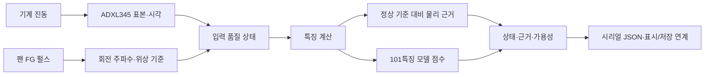

# 최종보고서 상세 해설

이 해설은 「인력난 현장을 위한 저비용 엣지 AI 예지보전 모듈, 엣지알리미」 22쪽 보고서의 데이터 흐름, 계산식, 구현, 평가 결과를 같은 순서로 설명한다. 각 절은 보고서 위치와 핵심 기호를 연결하고, 계산 예와 코드 근거를 함께 제시한다.

공개 산출물은 이 README와 상세 해설 `.md`, C 구현 `.c/.h`, Python 구현 `.py`로 구성된다. V2의 Python 계산은 `src/feature_extraction_v2.py`에 있고, 101특징 원본은 워크스페이스의 `fault_type_90_mechanical/`에서 `firmware_ml_evidence_live/tools/verify_ml.py`로 연결된다.

## 읽는 순서

| 순서 | 보고서 위치 | 상세 해설 | 초점 |
|---|---|---|---|
| 1 | Ⅰ~Ⅲ-1, 3~7쪽 | [전체 시스템](01-system.md) | 센서 입력에서 점검 정보까지의 데이터 흐름 |
| 2 | Ⅲ-2, 7~9쪽 | [물리 근거 경로](02-physical-evidence.md) | FFT, 대역 에너지, 정상 기준, 후보 근거 |
| 3 | Ⅲ-3, 10~11쪽 | [학습 모델과 101특징](03-ml-model.md) | 특징 순서, 표준화, 네 클래스 점수 |
| 4 | Ⅲ-4, 11쪽 | [결함별 물리 해석](04-fault-interpretation.md) | 후보별 신호와 입력 정보 |
| 5 | Ⅲ-5, 12~15쪽 | [FG V3와 하드웨어](05-fg-hardware.md) | 회전 기준, 동기 투영, 장치 인터페이스 |
| 6 | Ⅳ-1~4, 16~19쪽 | [결과와 검증 범위](06-results.md) | 평가 단위, 분자·분모, 실행 기록 |
| 7 | Ⅴ, 20~21쪽 | [기대효과와 운영 지표](07-effects-and-limits.md) | 점검 흐름에 기대하는 효과와 지표 |
| 8 | Ⅵ, 21~22쪽 | [출처와 코드 대응표](08-sources.md) | 보고서 인용, 현재 코드 위치, 추가 자료 |

## 시스템 흐름

물리 근거 경로는 설비별 정상 기준과 현재 진동을 비교하고, 학습 모델 경로는 한 축의 101개 특징으로 네 상태 마진을 계산한다. 전류·온도는 보고서의 보조 운전 정보이며, 핵심 진동 판정은 가속도와 회전 기준을 입력으로 삼는다.

## 구현 버전 안내

| 구현 | 현재 위치 | 주요 계산 |
|---|---|---|
| 저장소 FFT V2 | `edge_module_c/core/` | 기본값 $N=1024$, $f_s=1000$ Hz; 대칭 Hann, 진폭 스펙트럼, 로그 평균·표준편차 |
| PDF 표 4 분석 조건 | 최종보고서 8쪽 | $N=512$, $f_s=400$ Hz로 서술된 물리 분석 조건 |
| 보고서 FG V3 검증 사본 | `reports/algorithm-report-audit-2026-09-26/execution/firmware-build/` | FG 동기 1× 진폭·위상, 4/5 상태 정책 |
| 물리 근거 코어 | `fault_evidence_core/` | 주기형 Hann, g² 대역 전력, 중앙값·MAD, 후보 근거 |
| 101특징 모델·실시간 어댑터 | `firmware_ml_evidence_live/` | 400점 특징, 평균 fold 마진, 회전 차수 관측 마스크 |
| CWRU 베어링 경로 | `firmware_cwru_integration/` | 12 kHz·4,096점·6특징·네 클래스·4/5 |

보고서에서 검증한 FG V3 사본과 최신 2×·3× 확장 코드는 각각의 현재 위치와 계산 범위에 따라 설명한다.

## 근거 종류

| 근거 표기 | 내용 |
|---|---|
| 데이터시트 값 | 제조사 문서에 기재된 사양 |
| 구현·설계값 | 코드 상수, 입력 범위, 계산식 |
| 소프트웨어 기록 | Python/C 비교, 호스트 재생, 합성 입력, 컴파일·빌드 결과 |
| 공개 파형 평가 | 지정된 데이터·분할·판정 단위의 결과 |
| 장치 관측 | 보고서에 기록된 정상 팬 운전 측정값 |
| 입력 상태 | 계산 결과와 함께 반환되는 `valid`, `unavailable`, `null`, 오류 코드 |

## 추가 확보 원자료

평가 JSON의 기준 경로는 `F:/aihub_training_runs/`다.

| PDF 인용 | 원자료 | 연결 내용 |
|---|---|---|
| [6] | `bearing_continuous_simulation/result.json` `rotorkit_imbalance_1x/result.json` `belt_recurrence_diagnostic/belt_recurrence_diagnostic.json` `bearing_ac_rms_b01_b04/summary.json` `mock_exam_v2_improvement/diagnosis/*/diagnosis.json` | 평가 결과 JSON 4종과 정렬 불량 7개 설비 그룹의 진단 결과 |
| [11] | `test_steaystate_baseline10min.txt` | 정상 팬 336창 및 회전 1× 원기록 |
| [12] | `제5회 창의혁신 공모전 최종보고서 (4).docx` | 보고서 로그 변환 그림의 출처 원본 |
